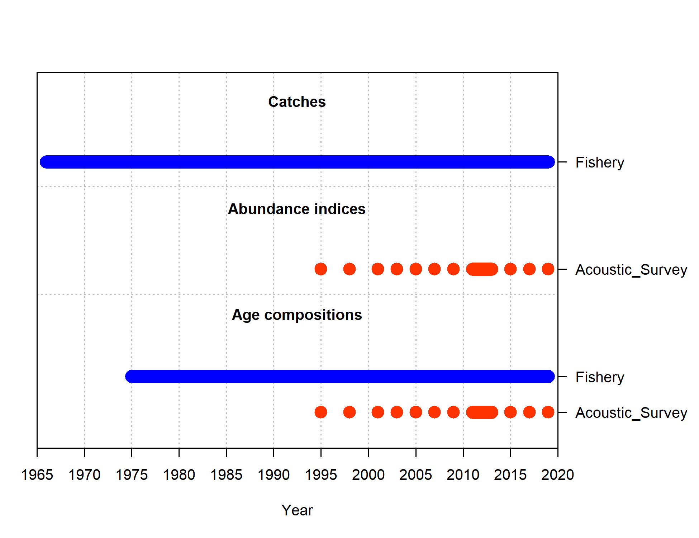

---
title: "sa4ss"
author: "Chantel Wetzel"
date: "`r Sys.Date()`"
output: pdf_document
vignette: >
  %\VignetteIndexEntry{sa4ss}
  %\VignetteEngine{knitr::rmarkdown}
  %\VignetteEncoding{UTF-8}
---

```{r setup, include = FALSE}
knitr::opts_chunk$set(
  collapse = TRUE,
  comment = "#>"
)

library(sa4ss)
```

# Getting Started
Want to create an assessment document using **sa4ss**? 

Load up the package available on [github](https://github.com/nwfsc-assess/sa4ss):

```r
remotes::install_github("nwfsc-assess/sa4ss")
library(sa4ss)
```

Now that the package is installed in R, let's create a document.  

## Step 1

Set the working directory. The document template will be created in the defined location.

```r
setwd("C:/Assessments/2021/copper_rockfish_2021/write_up/wa")

```

## Step 2

Call the draft function to create a general document with species, authors, and title created:

```r
sa4ss::draft(authors = c("Chantel R. Wetzel", 
                         "Brian J. Langseth", 
                         "Jason M. Cope", 
                         "Theresa Tsou",
                         "Kristen E. Hinton"),
  			 species = "Copper Rockfish",
  			 latin = "Sebastes caurinus",
  			 coast = "Washington US West",
  			 type = c("sa"),
  			 create_dir = FALSE,
  			 edit = FALSE)
```

The above example will  automatically populates a document for copper rockfish with the above authors and their associated affiliation.  **sa4ss* has a list of common authors and their affiliations already set-up. In order for authors to be found in the available list and their affiliation the names need to be entered exactly as expected here: https://github.com/nwfsc-assess/sa4ss/blob/master/data-raw/authors.csv.

The above call creates a number of files that will be used in the document (Introduction, Data, ...) and their subsections.  All files have a leading number at the start of the Rmd file names.  The order of the numbers indicates the order that each separate file will be stitched together to create the whole document.  If you would like to move the order of a text section of the document, you will just need to adjust the number order.  Additionally, when the documented is drafted a standard set of sections are created, however, not every assessment will need each section.  A common example are the standard survey files created (e.g. '21s-wcgbts'). If your assessment will not include data from a specific survey, this file can be removed from the document by deleting the file.

## Step 3

Create an Rdata object based upon the base model.  The base model can be located anywhere on your machine. 

```r
sa4ss::read_model(mod_loc = "C:/Assessments/2021/copper_rockfish_2021/models/base")
```

This will create an Rdata object called 00mod.Rdata in your working directory.

## Step 4

Render the pdf document based on the draft template created:

```r
bookdown::render_book("00a.Rmd", clean = FALSE, output_dir = getwd())

```

This will create build the pdf document which will be save directly in the working directory.  However, one may prefer to have the pdf saved in a specific folder.  One default approach is the call the render_book function without specifying the output_dir which will put the pdf document in a separate folder in the working directory. 

```r
bookdown::render_book("00a.Rmd", clean = FALSE)

```

# Editing the Document
A number of documents in the specified directory should not be available.  These documents correspond to different sections required by the Groundfish Terms of Reference. 

When editing make sure to render the document on a regular basis by using either of the above calls to:

```r
bookdown::render_book("00a.Rmd", clean = FALSE, output_dir = getwd())
```

This will allow users to identify errors quickly.  If the document rendered correctly the user should see that "Output created: _main.pdf" followed by miscellaneous other warnings in the R terminal.  


# Returning to the Document

If you are returning to edit your document at a later point, you will not need to redo steps 1-3 above.  To begin working on your document again you should:

1. Open an new R terminal.
2. Load of the package **library(sa4ss)**.
3. Set the working directory to where your document is located.
4. Open Rmd files and start editing your document. To render the book at any point in this process you just need to run the following call:

 ```r
bookdown::render_book("00a.Rmd", clean = FALSE)

``` 


# Error in Rendering

If you see an error and the document fails to render you will want to:

1. Open the _main.tex file, read the error message in the R terminal, and navigate to that line in the _main.tex file.  
2. Correct the error in the Rmd files.
3. Delete the _main.Rmd file in the folder.
4. Rerun the render line of code:

```r
bookdown::render_book("00a.Rmd", clean = FALSE, output_dir = getwd())
```

# Updating the Base Model

If the base model changes, the user will need to rerun the **read_model** function to load in the output from the new model run and locate and/or create figures and tables


```r
sa4ss::read_model(mod_loc = "C:/Assessments/2021/copper_rockfish_2021/models/new_base",
                 	create_plots = TRUE, 
				          save_loc = file.path(getwd(), "tex_tables"),
				          verbose = TRUE))
```

This will create a new model output Rdata file containing the output from **r4ss::SS_output** function which will replace the old file and be used to update the document to the new model the next time the document is rendered. This file is loaded automatically (sourced in the 00.Rmd file). In addition to creating an Rdata object with model information the **sa4ss::read_model** function also calls the **r4ss::SSexecutivesummary** function and creates csv tables used in the Executive Summary section and LaTex tex tables which can be used directly in the document.

# Tips & Tricks

## Share Text Across Documents
If you are creating an area-specific assessment document for species you may want to use the same text across multiple documents.  This can be easily done by creating separate folder for sections of text that will be shared across documents. Text should be included in a file with an Rmd extension and can be called using a code chunk with the **knit_child** command in the **knitr** package:


```{r}

other_loc = file.path('folder', 'child_example.Rmd')
res <- knitr::knit_child(other_loc, quiet = TRUE)
cat(res, sep = '\n')

```

## Add Figures from **r4ss**

There are a number of ways to add figures to the document, either in the executive summary or figures sections.  The first approach is to directly specify where the document is located, add a figure caption and alternative text caption (for accessibility), and specific a figure label which allows the user to reference the figure in the document. In the below example the figure (data-plot.png) is located in the same directory as the Rmd files being rendered. 

```{r, eval = FALSE}
# This is the text that is placed in the document:


{width=100% height=100% alt="Summary of data sources used in the base model"}

```

{width=75% height=75% alt="Summary of data sources used in the base model"}

Alternatively, the figure you want to include may be located in a folder outside the folder that you are rendering the document within.  To do this easily a function has been added to the **sa4ss** package that allows users to do this. 

```{r, eval = FALSE}
# The add_figure function has the user specific the figure and its location to be used. 

add_figure(
filein = file.path(mod_loc, "plots", "data_plot.png"), 
caption = "Summary of data sources used in the base model",
label = 'data-plot')

```

The above function, **add_figure**, contained in the **sa4ss** package will set the alternative text equal to the caption unless specifically specified by the user. 

Both examples above allow the user to reference the figure in the text using ```{r, eval = FALSE} \ref{fig:data-plot}``` which will look like this: Figure \ref{fig:data-plot}.

## Add Tables to the Document

There are a few options to add tables to the document. Rmarkdown allows users to create tables directly using **R** code blocks but users can also load existing tex table files. The **sa4ss::read_model** and the **sa4ss::es_table_tex** both creates tex files from csv files.   

If you have created tex table files they can be added to your document using the include command in LaTex:

```{r, eval = FALSE}

\include{tex_tables/Catches_All_Years.tex}

```

The above command will load model catches based on a tex table created by the **sa4ss::read_model** function which internally calls the **r4ss::SSexecutivesummary**  and **sa4ss::es_table_tex** functions. 

Another option for creating a table in a **sa4ss** document is to use a snippet of **R** code.  The below example reads in an existing csv and creates the needed format for *sa4ss**:

```{r, eval = FALSE}

tab = read.csv(file.path(mod_loc, 'tables', 'data_weights.csv'))
col_names = c('Method',
			        'Commercial Lengths',
              'Recreational Lengths')

sa4ss::table_format(x = tab,
             caption = "Data weights applied by each alternative data weighting methods.",
             label = "dw",
             align = 'l',
             col_names = col_names)
```

where the **sa4ss::table_format** function allows you to specify the table caption to use, the column names (col_names), and how to reference the table in the text (label). This table will appear in the document as:

```{r, echo = FALSE, eval = TRUE}

tab = read.csv(file.path('C:/Assessments/2021/copper_rockfish_2021/models/or/6.0_base/tables/data_weights.csv'))
col_names = c('Method',
			        'Commercial Lengths',
              'Recreational Lengths')

sa4ss::table_format(x = tab,
             caption = "Data weights applied by each alternative data weighting methods.",
             label = "dw",
             align = 'l',
             col_names = col_names)
```


## Referencing Figures and Tables

Tables and figures can be referenced in text by using the ref command:

```{r, eval = FALSE}

The data weights applied in the base model are shown in Table \ref{tab:dw}.

The data used in the model are shown in Figure \ref{fig:data-plot}.

```

Each of the above examples will appear in the text as:

The data weights applied in the base model are shown in Table \ref{tab:dw}.

The data used in the model are shown in Figure \ref{fig:data-plot}.


