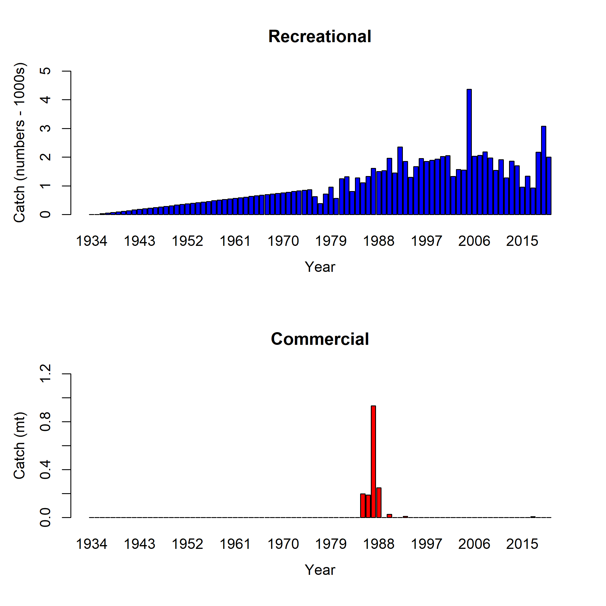

\clearpage
# Figures


<!-- ====================================================================== -->  
<!-- ****************** Catches Used in the Model ************************* --> 
<!-- ====================================================================== -->  

{width=100% height=100% alt="Catches by year for the recreational and commercial fleets in the model"}


<!-- ====================================================================== --> 
<!-- ******************* Data Used in the Model *************************** --> 
<!-- ====================================================================== --> 

```{r, results = 'asis'}
add_figure(
filein = file.path(mod_loc, "plots", "data_plot.png"), 
caption = "Summary of data sources used in the base model",
label = 'data-plot')
```	


<!-- ====================================================================== -->
<!-- ****************   Commercial Length Samples    ********************** --> 
<!-- ====================================================================== -->


<!-- ====================================================================== -->
<!-- **************** Recreational Length Samples    ********************** --> 
<!-- ====================================================================== -->

```{r, results = 'asis'}
add_figure(
filein = file.path(mod_loc, "plots", "comp_lendat_bubflt1mkt0_page2.png"), 
caption = "Length composition data from the recreational fleet",
label = 'wa-len-data')
```

```{r, results = 'asis'}
add_figure(
filein = file.path(mod_loc, "plots", "comp_lendat_data_weighting_TA1.8_WA_Recreational.png"), 
caption = "Mean length for recreational fleet with 95 percent confidence intervals",
label = 'mean-len-data')
```


<!-- ====================================================================== -->
<!-- *************************     Biology     **************************** --> 
<!-- ====================================================================== -->

```{r, echo=FALSE, results='asis'}

filein = file.path(general_wd,'figures_biology.Rmd')
read_child(filein)

```

<!-- ====================================================================== -->
<!-- *********************    Selectivity            ********************** --> 
<!-- ====================================================================== -->

```{r, results = 'asis'}
add_figure(
filein = file.path(mod_loc, "plots", "sel01_multiple_fleets_length1.png"), 
caption = "Selectivity at length by fleet",
label = 'selex')
```

<!-- ====================================================================== -->
<!-- *********************   Recruitment     ****************************** --> 
<!-- ====================================================================== -->

```{r, results = 'asis'}
add_figure(
filein = file.path(mod_loc, "plots", "ts11_Age-0_recruits_(1000s)_with_95_asymptotic_intervals.png"), 
caption = "Estimated time series of age-0 recruits (1000s)",
label = 'recruits')
```


<!-- ====================================================================== -->
<!-- ****************** Fit to the Length Data **************************** --> 
<!-- ====================================================================== -->

```{r, results = 'asis'}
add_figure(
filein = file.path(mod_loc, "plots", "bio1_sizeatage.png"), 
caption = "Length at age in the beginning of the year in the ending year of the model",
label = 'len-age-ss')
```


```{r, results = 'asis'}
add_figure(
filein = file.path(mod_loc, "plots", "comp_lenfit_residsflt1mkt0_page2.png"), 
caption = "Pearson residuals for recreational fleet. Closed bubble are positive residuals (observed > expected) and open bubbles are negative residuals (observed < expected)",
label = 'rec-pearson')
```

```{r, results = 'asis'}
add_figure(
filein = file.path(mod_loc, "plots", "comp_lenfit_data_weighting_TA1.8_WA_Recreational.png"), 
caption = "Mean length for recreational with 95 percent confidence intervals based on current samples sizes",
label = 'rec-mean-len-fit')
```

```{r, results = 'asis'}
add_figure(
filein = file.path(mod_loc, "plots", "comp_lenfit__aggregated_across_time.png"), 
caption = "Aggregated length comps over all years",
label = 'agg-len-fit')
```

<!-- ====================================================================== -->
<!-- ******************      Time Series       **************************** --> 
<!-- ====================================================================== -->

```{r, results = 'asis'}
add_figure(
filein = file.path(mod_loc, "plots", "ts7_Spawning_output_with_95_asymptotic_intervals_intervals.png"), 
caption = "Estimated time series of spawning output",
label = 'ssb')
```

```{r, results = 'asis'}
add_figure(
filein = file.path(mod_loc, "plots", "ts1_Total_biomass_(mt).png"), 
caption = "Estimated time series of total biomass",
label = 'tot-bio')
```

```{r, results = 'asis'}
add_figure(
filein = file.path(mod_loc, "plots", "ts9_Fraction_of_unfished_with_95_asymptotic_intervals_intervals.png"), 
caption = "Estimated time series of fraction of unfished spawning output",
label = 'depl')
```

```{r, results = 'asis'}
add_figure(
filein = file.path(mod_loc, "plots", "SR_curve.png"), 
caption = "Stock-recruit curve. Point colors indicate year, with warmer colors indicating earlier years and cooler colors in showing later years",
label = 'bh-curve')
```


<!-- ====================================================================== -->
<!-- ******************       Sensitivity     ***************************** --> 
<!-- ====================================================================== -->

```{r, echo=FALSE, results='asis'}
sens_wd = file.path(substr(mod_loc, 1, 50), "_sensitivities", "_plots")
nm = paste0(substr(mod_loc, 52, 99), "_compare2_spawnbio_uncertainty.png")
add_figure(
filein = file.path(sens_wd, nm),
caption = "Change in estimated spawning output by sensitivity",
label = 'sens-ssb')
```

```{r, echo=FALSE, results='asis'}
nm = paste0(substr(mod_loc, 52, 99), "_compare4_Bratio_uncertainty.png")
add_figure(
filein = file.path(sens_wd, nm),
caption = "Change in estimated fraction unfished by sensitivity",
label = 'sens-depl')
```

<!-- ====================================================================== -->
<!-- ******************     Retrospectives    ***************************** --> 
<!-- ====================================================================== -->

```{r, echo=FALSE, results='asis'}
filein = file.path(general_wd,'figures_retro.Rmd')
read_child(filein)
```

<!-- ====================================================================== -->
<!-- ******************      Likelihoods      ***************************** --> 
<!-- ====================================================================== -->

```{r, echo=FALSE, results='asis'}
filein = file.path(general_wd,'figures_likelihoods.Rmd')
read_child(filein)
```


<!-- ====================================================================== -->
<!-- ******************    Reference Points    **************************** --> 
<!-- ====================================================================== -->


```{r, results = 'asis'}
add_figure(
filein = file.path(mod_loc, "plots", "SPR2_minusSPRseries.png"), 
caption = "Estimated 1 - relative spawning ratio (SPR) by year",
label = '1-spr')
```

```{r, results = 'asis'}
add_figure(
filein = file.path(mod_loc, "plots", "yield2_yield_curve_with_refpoints.png"), 
caption = "Equilibrium yield curve for the base case model. Values are based on the 2020
fishery selectivity and with steepness fixed at 0.72",
label = 'yield')
```


\newpage