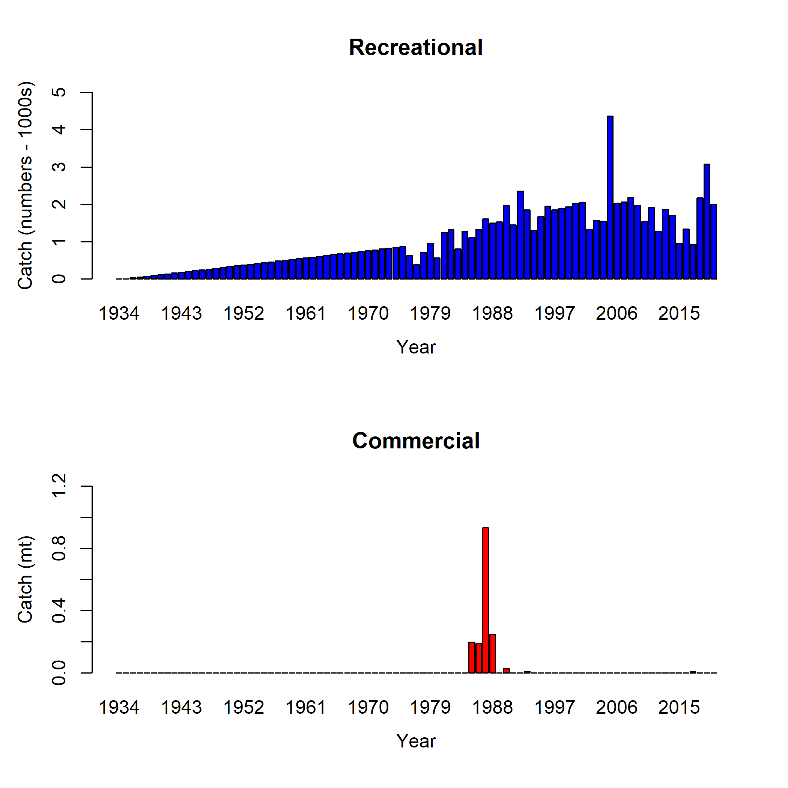

```{r opts, include = FALSE}
# I added the cache = TRUE to try to speed up but not sure if this is right
knitr::opts_chunk$set(echo = FALSE, warning = FALSE, message = FALSE)
knitr::knit_hooks$set(plot = function(x,options) {
      base = knitr::opts_knit$get('base.url')
      if (is.null(base)) base = ''
      alt = ifelse (is.null(options$alt),"",options$alt)
      cap = ifelse (is.null(options$caption),"",options$caption)
      if (alt != ""){
        sprintf('', cap, base, x, alt)
      } else {
        sprintf('', cap, base, x)  
        }
  })

load("00opts.Rdata")
# changing what I used in the draft function
spp = 'copper rockfish'
Spp = 'Copper rockfish'

if(file.exists("00mod.Rdata")){
  load("00mod.Rdata")
} else {
  print("Model output not being read. Please run the read_model() function.")
}
```

<!--chapter:end:00a.Rmd-->

---
author:
  - name: Chantel R. Wetzel
    code: 1
    first: C
    middle: R
    family: Wetzel
  - name: Brian J. Langseth
    code: 1
    first: B
    middle: J
    family: Langseth
  - name: Jason M. Cope
    code: 1
    first: J
    middle: M
    family: Cope
  - name: Tien-Shui Tsou
    code: 2
    first: T
    middle: ''
    family: Tsou
  - name: Kristen E. Hinton
    code: 2
    first: K
    middle: E
    family: Hinton
author_list: Wetzel, C.R., B.J. Langseth, J.M. Cope, T. Tsou, K.E. Hinton
affiliation:
  - code: 1
    address: Northwest Fisheries Science Center, U.S. Department of Commerce, National
      Oceanic and Atmospheric Administration, National Marine Fisheries Service, 2725
      Montlake Boulevard East, Seattle, Washington 98112
  - code: 2
    address: Washington Department of Fish and Wildlife, 600 Capital Way North, Olympia,
      Washington 98501
address:
  - ^1^Northwest Fisheries Science Center, U.S. Department of Commerce, National Oceanic
    and Atmospheric Administration, National Marine Fisheries Service, 2725 Montlake
    Boulevard East, Seattle, Washington 98112
  - ^2^Washington Department of Fish and Wildlife, 600 Capital Way North, Olympia,
    Washington 98501
---

<!--chapter:end:00authors.Rmd-->

---
title: Status of copper rockfish (_Sebastes caurinus_) along the Washigton US West coast in 2020
---

<!--chapter:end:00title.Rmd-->

\pagebreak
\pagenumbering{roman}
\setcounter{page}{1}
\renewcommand{\thetable}{\roman{table}}
\renewcommand{\thefigure}{\roman{figure}}


<!--chapter:end:01a.Rmd-->

```{r executive, echo = FALSE}
executive <- list()
executive[["stock"]] <- paste0("This assessment reports the status of ",
  spp, " (_", spp.sci, "_) off the ", coast, 
  " coast using data through 2020.")

general_wd <-  'C:/Assessments/2021/copper_rockfish_2021/write_up/general_text'
```

<!--chapter:end:01executive.Rmd-->

\pagebreak
\setlength{\parskip}{5mm plus1mm minus1mm}
\pagenumbering{arabic}
\setcounter{page}{1}
\renewcommand{\thefigure}{\arabic{figure}}
\renewcommand{\thetable}{\arabic{table}}
\setcounter{table}{0}
\setcounter{figure}{0}

<!--chapter:end:10a.Rmd-->

# Introduction

```{r, echo=FALSE, results='asis'}
general_wd = "C:/Assessments/2021/copper_rockfish_2021/write_up/general_text"
filein = file.path(general_wd,'1_intro_life_history_fishery_info.Rmd')
read_child(filein)
```

## Historical and Current Fishery Information
Replace text.

## Summary of Management History and Performance
Replace text.

## Foreign Fisheries
Replace text.

<!--chapter:end:11introduction.Rmd-->

# Data

A description of each data source is provided below (Figure \ref{fig:data-plot}).

<!--chapter:end:20data.Rmd-->

## Fishery-Dependent Data

[@ralston_documentation_2010]

<!--chapter:end:21f-.Rmd-->

## Fishery-Independent Data

There were no fishery-independent data sources available for `r spp` off the Washington coast to be considered for this assessment.

<!--chapter:end:21s-.Rmd-->

## Biological Data

### Natural Mortality

```{r, echo=FALSE, results='asis'}
#filein = file.path('..', 'general_text', 'data_m.Rmd')
filein = file.path(general_wd,'data_m.Rmd')
read_child(filein)
```


### Maturation and Fecundity

```{r, echo=FALSE, results='asis'}
filein = file.path(general_wd,'data_fecund_mat.Rmd')
read_child(filein)
```

### Sex Ratio

```{r, echo=FALSE, results='asis'}
filein = file.path(general_wd,'data_sex_ratio.Rmd')
read_child(filein)
```


### Length-Weight Relationship

```{r, echo=FALSE, results='asis'}
filein = file.path(general_wd,'data_length_weight.Rmd')
read_child(filein)
```

### Growth (Length-at-Age)

```{r, echo=FALSE, results='asis'}
filein = file.path(general_wd,'data_length_age.Rmd')
read_child(filein)
```


<!--chapter:end:22biology.Rmd-->

# Assessment Model


<!--chapter:end:30model.Rmd-->

## Summary of Previous Assessments and Reviews


### History of Modeling Approaches (not required for an update assessment)


### Most Recent STAR Panel and SSC Recommendations (not required for an update assessment)


### Response to Groundfish Subcommittee Requests (not required in draft)

<!--chapter:end:31summary.Rmd-->

## Model Structure and Assumptions


### Model Changes from the Last Assessment (not required for an update assessment)


### Modeling Platform and Structure
General model specifications (e.g., executable version, model structure, definition of fleets and areas)


### Model Parameters
Describe estimated vs. fixed parameters, priors

### Key Assumptions and Structural Choices

<!--chapter:end:32structure.Rmd-->

## Base Model Results


### Parameter Estimates

### Fits to the Data

### Population Trajectory

### Reference Points


<!--chapter:end:33results.Rmd-->

## Model Diagnostics
Describe all diagnostics

### Convergence

### Sensitivity Analyses

### Retrospective Analysis

### Likelihood Profiles

### Unresolved Problems and Major Uncertainties

<!--chapter:end:34diagnostics.Rmd-->

# Management 

## Reference Points

## Unresolved Problems and Major Uncertainties

## Harvest Projections and Decision Tables

## Evaluation of Scientific Uncertainty

## Research and Data Needs

<!--chapter:end:40management.Rmd-->

# Acknowledgments
Here are all the mad props!

Merit McCrea, Gerry Richter, Louis Zimm, Daniel Platt

<!--chapter:end:41acknowledgments.Rmd-->

# Tables

```{r}
tab = read.csv(file.path(mod_loc, "tables", "Catches_All_Years.csv"))
col_names = c("Year", "Recreational (mt)", "Commercial (mt)", "Total Mortality")

table_format(x = tab,
			caption = 'Removals by fleet for all model years.',
			label = 'allmortality',
			digits = c(0, 2, 2,2),
			longtable = TRUE,
			col_names = col_names,
			align = c('r','c','c','c'))
```


\input{C:/Assessments/2021/copper_rockfish_2021/models/wa/0.0_init_model/tables/TimeSeries.tex}

<!--chapter:end:52tables.Rmd-->

# Figures


<!-- ====================================================================== -->  
<!-- ****************** Catches Used in the Model ************************* --> 
<!-- ====================================================================== -->  

{width=100% height=100% alt="Catches by year for the recreational and commercial fleets in the model"}


<!-- ====================================================================== --> 
<!-- ******************* Data Used in the Model *************************** --> 
<!-- ====================================================================== --> 

```{r, results = 'asis'}
add_figure(
filein = file.path(mod_loc, "plots", "data_plot.png"), 
caption = "Summary of data sources used in the base model",
label = 'data-plot')
```	

<!-- ====================================================================== --> 
<!-- ***********************    Biology         *************************** --> 
<!-- ====================================================================== --> 
```{r}
# Should move this in the init section
data_fig_loc = "//nwcfile/FRAM/Assessments/CurrentAssessments/DataModerate_2021/copper_rockfish/data/biology/plots"

```

```{r, results = 'asis'}
add_figure(
filein = file.path(data_fig_loc, "doc_Length_Weight_Sex.png"), 
caption = "Survey length-at-weight data with sex specific estimated fits.",
label = 'len-weight')
```	

```{r, results = 'asis'}
add_figure(
filein = file.path(data_fig_loc, "doc_Length_Weight_Source.png"), 
caption = "Comparison of the length-at-weight data from the NWFSC Hook and Line and the NWFSC WCGBT surveys.",
label = 'len-weight-survey')
```	

```{r, results = 'asis'}
add_figure(
filein = file.path(data_fig_loc, "doc_Length_Age_by_Sex.png"), 
caption = "Length-at-age data from the with sex specific estimated growth.",
label = 'len-age')
```	

```{r, results = 'asis'}
add_figure(
filein = file.path(data_fig_loc, "doc_Data_Length_Age_by_Sex.png"), 
caption = "Observed length-at-age by data source.",
label = 'len-age-data')
```	


<!-- ====================================================================== -->
<!-- **************** Recreational Length Samples    ********************** --> 
<!-- ====================================================================== -->


<!-- ====================================================================== -->
<!-- *************************     Biology     **************************** --> 
<!-- ====================================================================== -->

```{r, results = 'asis'}
add_figure(
filein = file.path(mod_loc, "plots", "bio1_sizeatage.png"), 
caption = "Length at age in the beginning of the year in the ending year of the model",
label = 'len-at-age')
```

```{r, results = 'asis'}
add_figure(
filein = file.path(mod_loc, "plots", "bio5_weightatsize.png"), 
caption = "Weight at length by sex",
label = 'weight')
```

```{r, results = 'asis'}
add_figure(
filein = file.path(mod_loc, "plots", "bio6_maturity.png"), 
caption = "Maturity at length",
label = 'maturity')
```

```{r, results = 'asis'}
add_figure(
filein = file.path(mod_loc, "plots", "bio9_fecundity_len.png"), 
caption = "Fecundity at a function of length",
label = 'fecundity')
```

<!-- ====================================================================== -->
<!-- *********************   Estimated SSB   ****************************** --> 
<!-- ====================================================================== -->

<!-- ====================================================================== -->
<!-- *********************    Selectivity            ********************** --> 
<!-- ====================================================================== -->

```{r, results = 'asis'}
add_figure(
filein = file.path(mod_loc, "plots", "sel01_multiple_fleets_length1.png"), 
caption = "Selectivity at length by fleet",
label = 'selex')
```

<!-- ====================================================================== -->
<!-- *********************   Recruitment     ****************************** --> 
<!-- ====================================================================== -->


<!-- ====================================================================== -->
<!-- ****************** Fit to the Length Data **************************** --> 
<!-- ====================================================================== -->


<!-- ====================================================================== -->
<!-- ******************      Time Series       **************************** --> 
<!-- ====================================================================== -->

```{r, results = 'asis'}
add_figure(
filein = file.path(mod_loc, "plots", "ts7_Spawning_output.png"), 
caption = "Estimate time series of spawning output.",
label = 'ssb')
```

<!-- ====================================================================== -->
<!-- ******************    Reference Points    **************************** --> 
<!-- ====================================================================== -->


<!-- ====================================================================== -->
<!-- ******************       Sensitivity     ***************************** --> 
<!-- ====================================================================== -->


<!-- ====================================================================== -->
<!-- ******************     Retrospectives    ***************************** --> 
<!-- ====================================================================== -->


<!-- ====================================================================== -->
<!-- ******************      Likelihoods      ***************************** --> 
<!-- ====================================================================== -->

<!--chapter:end:53figures.Rmd-->

<!-- If you want to references to appear somewhere before the end, add: -->
<!-- <div id="refs"></div> -->
<!-- where you want it to appear -->

\clearpage

# References

<!-- The following sets the appropriate indentation for the references
  but it cannot be used with bookdown and the make file because it leads
  to a bad pdf.
\noindent
\vspace{-2em}
\setlength{\parindent}{-0.2in}
\setlength{\leftskip}{0.2in}
\setlength{\parskip}{8pt}
 -->

<!--chapter:end:54bibliography.Rmd-->

